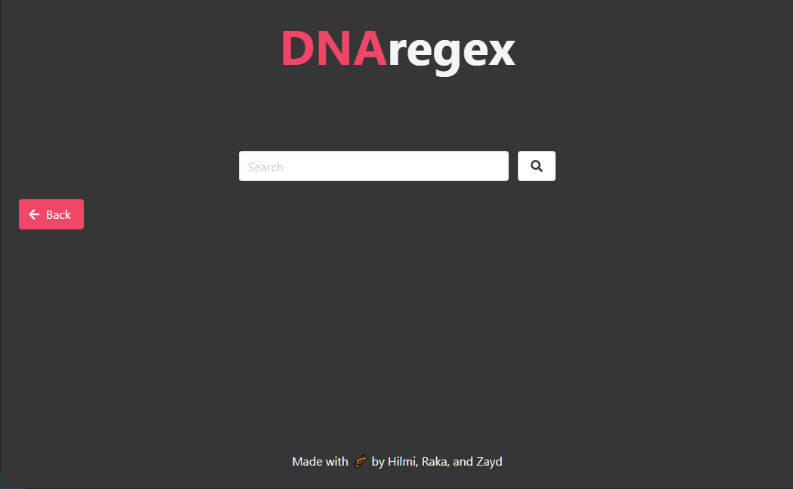

# DNA Pattern Matching App
> Aplikasi yang mengimplementasikan algoritma KMP, Boyer-Moore, dan teori Regex untuk mendeteksi apakah seorang pasien memiliki penyakit genetik tertentu.  
> Live demo klik https://dnaregex.vercel.app/.   <!-- If you have the project hosted somewhere, include the link here. -->
> Untuk mencoba eksekusi program melalui lokal, bisa dengan cara menginstall angular, kemudian masuk ke folder src/dnaregex, lalu eksekusi "ng serve".
## Table of Contents
* [General Info](#general-information)
* [Features](#features)
* [Screenshots](#screenshots)
* [Setup](#setup)
* [Usage](#usage)
* [Project Status](#project-status)
* [Acknowledgements](#acknowledgements)
* [Contact](#contact)
<!-- * [License](#license) -->

## General Information
DNA manusia yang mengandung pattern tertentu biasanya mengandung penyakit khusus. Hal ini dapat diperiksa apabila dilakukan pencocokan antara pattern penyakit dengan DNA dari manusia. Permasalahan ini dapat diselesaikan dengan membangun aplikasi yang secara otomatis dapat menentukan apakah seorang manusia memiliki pattern khusus penyakit atau tidak.
<!-- You don't have to answer all the questions - just the ones relevant to your project. -->

## Features
Fitur - fitur yang dapat digunakan pada aplikasi ini:
- Pemasukkan nama penyakit dan pattern DNA penyakit tersebut
- Pencocokan DNA manusia beserta dugaan penyakitnya
- Riwayat pencocokan (beserta waktu pencocokan)

## Screenshots

<!-- If you have screenshots you'd like to share, include them here. -->

## Setup
<!--What are the project requirements/dependencies? Where are they listed? A requirements.txt or a Pipfile.lock file perhaps? Where is it located?

Proceed to describe how to install / setup one's local environment / get started with the project.-->

- Node JS - version 16.14.2
- Angular
- SQL

## Usage
Contoh dari input program bisa diakses melalui folder test. Folder Disease dan file di folder test merupakan file input untuk input penyakit, sedangkan folder HumanDNA merupakan file input untuk input penyakit.

## Project Status
Status Proyek: _complete_.  
Seluruh fitur telah selesai.
<!-- / _complete_ / _no longer being worked on_-->

## Acknowledgements
Give credit here.
- Proyek ini dapat terwujudkan dalam rangka memenuhi Tugas Besar 3 mata kuliah IF2211 Strategi Algoritma 2021/2022
- Terima kasih yang sebanyak-banyaknya kepada para dosen, asisten dosen, dan kelompok 32 yang telah berkontribusi dalam menyelesaikan Tugas Besar ini.

## Author
| No. | Nama | NIM |
| :---: | :---: | :---: |
| 1. | Raka Wirabuana Ninagan | 13520134 |
| 2. | Zayd Muhammad Kawakibi Zuhri | 13520144 |
| 3. | Mohamad Hilmi Rinaldi| 13520149 |

Created by DNAregex. 2022.  
All Rights Reserved.